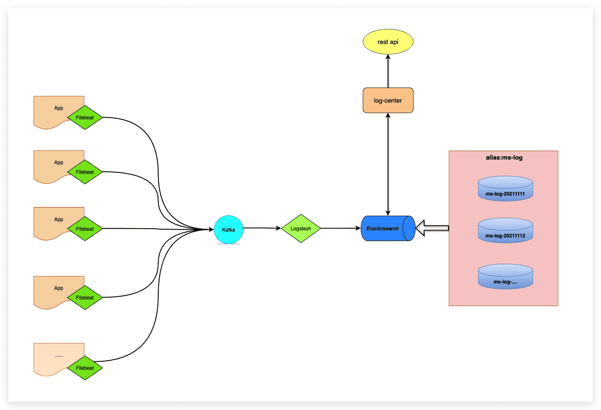

# microservices-log-center
微服务日志中心

## 需求介绍

微服务平台所有应用的运行日志信息，需要接入到ELK里面，并提供接口：查询具体应用的运行日志信息。

## 日志收集拓扑图



## 设计思路

1. 应用app运行在容器（物理机）里，容器（物理机）内须自带Filebeat程序收集日志

2. 收集完成后传给kafka集群，logstash读取kafka集群数据写入elasticsearch集群

3. kibana读取elasticsearch集群数据展示在web上，开发、运维等需要查看日志的用户登录kibana查看

4. 通过集成`log-center`日志中心来对外提供查询接口

   

## 设计分析与实现

### 应用客户端与filebeat

基于filebeat的特性，filebeat需要访问具体的log文件路径，这时候如果用单独用容器跑filebeat的话，就需要将应用的log文件映射到filebeat容器内，不是很方便，所以这里设计了：把filebeat放到容器内，伴随着容器的启动，filebeat也一同启动。

配置文件`/usr/share/filebeat/filebeat.yml`：见附件 [filebeat.yml](conf/filebeat.yml)

> 注意：
>
> - 根据自身环境修改kafka集群地址
> - 其他配置保持默认即可，否则有可能出问题


### logstash与elasticsearch

>由于需要根据关键字进行查询，所以es需要配置ik分词器，否则logstash执行报错！

logstash在从kafka收集日志后，往es中进行写入之前，若索引不存在，需要创建相应的索引，索引名这里规范：字符串+年月日(例如：ms-log-20211117)，其中`ms-logs`是固定字符串，每天生成一个索引，并且每个索引都要有个固定别名：`ms-log`，这很重要，方便后续的检索。

- logstash主配置文件：路径`/usr/share/logstash/config/logstash.yml `见附件[logstash.yml](conf/logstash.yml)

- logstash日志收集配置文件，路径：`/usr/share/logstash/pipeline/ms.conf`见附件[ms.conf](conf/ms.conf)

  >注意：
  >
  >- 根据自身环境修改kafka地址：`input.kafka.bootstrap_servers`
  >- 根据自身环境修改es集群地址：`output.elasticsearch.hosts`
  >- 若想修改索引前缀，改 `output.elasticsearch.index`字段的`ms-log`即可，不过，这里修改后，需要修改下面的索引模版`ms-template.json`中的**index_patterns**字段。

- logstash索引模版，路径：`/usr/share/logstash/pipeline/ms-template.json`见附件[ms-template.json](conf/ms-template.json)

### log-center与查询接口实现

SDK里面主要是对es的查询：根据应用名、关键字、日志级别、时间区间进行检索。

例如：以下在kibana中执行

```json
GET /ms-log/_search
{
  "query": {
    "bool": {
      "must": [
        {
          "term": {
            "app_index.keyword": {
              "value": "test_consumer"
            }
          }
        },
        {
          "term": {
            "message_info": {
              "value": "apollo"
            }
          }
        },
        {
          "term": {
            "level.keyword": {
              "value": "WARN"
            }
          }
        },
        {
          "range": {
            "@log_timestamp": {
              "gte": "2021-11-17 15:14:56.000",
              "lte": "2021-11-17 15:14:56.470",
              "format": "yyyy-MM-dd HH:mm:ss.SSS",
              "time_zone": "Asia/Shanghai"
            }
          }
        }
      ]
    }
  },
  "sort": [
    {
      "@log_timestamp": {
        "order": "desc"
      }
    }
  ]
}
```
